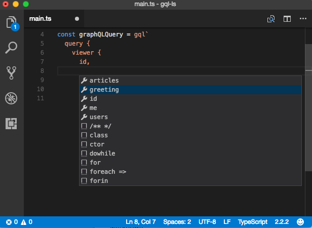

# ts-graphql-plugin [](https://app.wercker.com/project/byKey/c2528abe2327a0b1dfa007225f2de471) [](https://badge.fury.io/js/ts-graphql-plugin)

**It's highly experimental!**

TypeScript Language Service Plugin to help GraphQL client(e.g. Apollo, Relay, etc...) development.
This plugin parses template strings in .ts files and analyzes syntax using graphql-language-service-interface.



## Features

This plugin extends TypeScript Language Service and provides the following features:

- Completion Suggestion

## Usage

First, confirm that your project has typescript(v2.3.x or later) and graphql.

To install this plugin, execute the following:

```sh
npm install ts-graphql-plugin -D
```

And configure `plugins` section of your tsconfig.json, for example:

```json
{
  "compilerOptions": {
    "module": "commonjs",
    "target": "es5",
    "plugins": [
      { "name": "ts-graphql-plugin", "schema": "path-to-your-schema.json" }
    ]
  }
}
```

This plugin requires a parameter, which is `schema`. It should point your GraphQL schema data.
You can generate it using `introspectionQuery`. If you want detail, see https://facebook.github.io/relay/docs/guides-babel-plugin.html#schema-json .

## License
This software is released under the MIT License, see LICENSE.txt.
